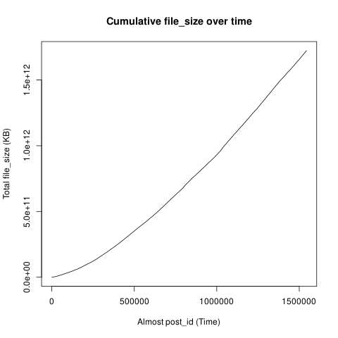
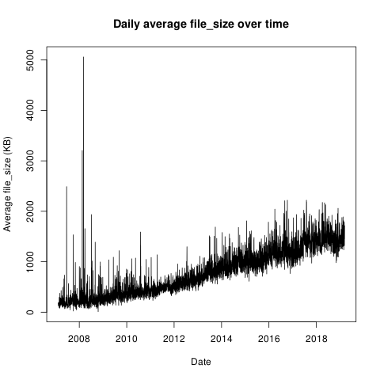
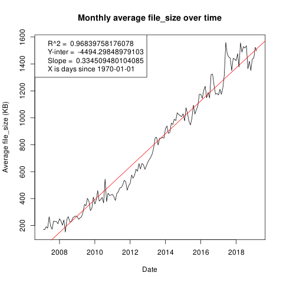
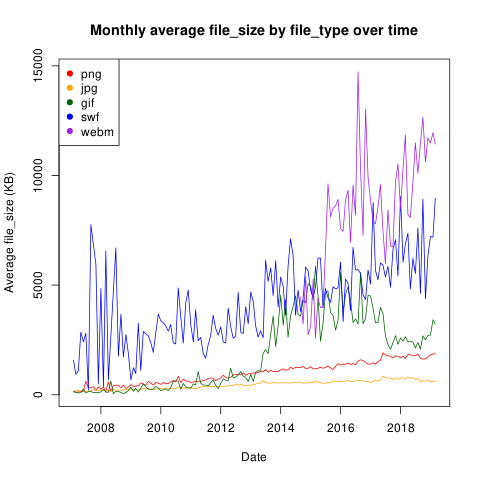

Is file bloat actually a thing that happens? Are files getting larger at an alarming rate, without much gain?

*Note*: I realize that I could have accessed the columns of the csv file with `file_obj$column_name` but I have chosen not to update this document in that style.

---

Lets start off with something simple and look at the cumulative file size.
First we need to get the data

```sql
select file_size, extract(epoch from created_at)::float / 1000.0 as uploaded_at
from posts
order by post_id asc
```

And then make a graph.

```R
file_sizes <- read.csv("ordered_file_size.csv")
png(filename = "cumulative.png")
plot(
	cumsum(as.numeric(file_sizes[, 1])),
	main = "Cumulative file_size over time",
	type = "l",
	xlab = "Almost post_id (Time)",
	ylab = "Total file_size (KB)"
)
```



This doesn't look very useful. We do see that in the start posts were of a smaller file size, but we don't know much more than that.

---

Well a next step could be to look at what the daily average of file_size was.

```sql
select
	avg(file_size)/1000.0 as average,
	date_trunc('day', created_at)::date as uploaded_at
from posts
group by uploaded_at
order by uploaded_at asc
```
```R
averages <- read.csv("daily_averages.csv")
png(filename = "daily_averages.png")
plot(
	averages[, 1] ~ as.Date(averages[, 2]),
	main = "Daily average file_size over time",
	type = "l",
	xlab = "Date",
	ylab = "Average file_size (KB)"
)
```


Whoa, that looks like it has some outliers. The problem dates seem to be
[2008-03-07](https://e621.net/post/index/1/date:2008-03-07),
[2008-02-16](https://e621.net/post/index/1/date:2008-02-16), and
[2007-06-20](https://e621.net/post/index/1/date:2007-06-20)
in decreasing order.

---

Lets increase it to a monthly average and add a linear trend line

```sql
select
	avg(file_size)/1000.0 as average,
	date_trunc('month', created_at)::date as uploaded_at
from posts
group by uploaded_at
order by uploaded_at asc
```

```R
averages <- read.csv("monthly_averages.csv")
png(filename = "monthly_averages.png")
plot(
	averages[, 1] ~ as.Date(averages[, 2]),
	main = "Monthly average file_size over time",
	type = "l",
	xlab = "Date",
	ylab = "Average file_size (KB)"
)

linear_model <- lm(averages[, 1] ~ as.Date(averages[, 2]))
abline(
	linear_model,
	col = "red"
)

info <- summary(linear_model)
legend(
	"topleft",
	legend = c(
		paste("R^2 = ", info$r.squared),
		paste("Y-inter = ", linear_model[[1]][1]),
		paste("Slope = ", linear_model[[1]][2]),
		"X is days since 1970-01-01"
	)
)
```



---

Well now that we have that, how does this change for each filetype?

```sql
select
	avg(file_size)/1000.0 as average,
	date_trunc('month', created_at)::date as uploaded_at,
	file_ext as file_type
from posts
group by file_type, uploaded_at
order by uploaded_at asc
```
```R
averages <- read.csv("monthly_file_averages.csv")
pngs <- subset(averages, file_type==1)
jpgs <- subset(averages, file_type==2)
gifs <- subset(averages, file_type==3)
swfs <- subset(averages, file_type==4)
webms <- subset(averages, file_type==5)

png(filename = "monthly_file_averages.png")
plot(
	pngs[, 1] ~ as.Date(pngs[, 2]),
	ylim = c(min(averages[, 1]), max(averages[, 1])),
	main = "Monthly average file size over time by file type",
	type = "l",
	xlab = "Date",
	ylab = "Average file_size (KB)",
	col = "red"
)

lines(jpgs[, 1] ~ as.Date(jpgs[, 2]), col = "orange")
lines(gifs[, 1] ~ as.Date(gifs[, 2]), col = "darkgreen")
lines(swfs[, 1] ~ as.Date(swfs[, 2]), col = "blue")
lines(webms[, 1] ~ as.Date(webms[, 2]), col = "purple")

legend(
	"topleft",
	pch = c(19, 19, 19, 19, 19),
	col = c("red", "orange", "darkgreen", "blue", "purple"),
	legend = c("png", "jpg", "gif", "swf", "webm")
)
```



---

Lets smooth out **gifs**, **swfs**, and **webms** by measuring them over a year long period instead of a month long. We can use the same R code from above with very minor changes.

```sql
select avg(file_size) / 1000, uploaded_at, file_type
from (
	select
		file_size,
		date_trunc('month', created_at)::date as uploaded_at,
		file_ext as file_type
	from posts where not Array[3, 4, 5] @> Array[file_ext]
	union
	select
		file_size,
		date_trunc('year', created_at)::date as uploaded_at,
		file_ext as file_type
	from posts where Array[3, 4, 5] @> Array[file_ext]
) as smooth
group by file_type, uploaded_at
order by uploaded_at asc
```

