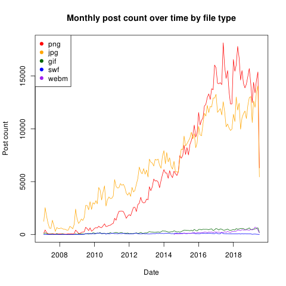

It's been a while. This is a quick sidestep from the <a href="./../file_size_over_time">file size over time</a> to show post count over time. Between now and then the database schema has been updated, so the sql will not match, but here it is anyways.

```sql
select
	count(*),
	date_trunc('month', created_at)::date as uploaded_at,
	file_type
from e621.posts
inner join e621.files using(post_id)
group by file_type, date_trunc('month', created_at)::date
```

```R
post_count <- read.csv("data.csv")
pngs <- subset(post_count, file_type=="png")
jpgs <- subset(post_count, file_type=="jpg")
gifs <- subset(post_count, file_type=="gif")
swfs <- subset(post_count, file_type=="swf")
webms <- subset(post_count, file_type=="webm")

png(filename = "monthly_file_post_count.png")
plot(
	pngs[, 1] ~ as.Date(pngs[, 2]),
	ylim = c(min(post_count[, 1]), max(post_count[, 1])),
	main = "Monthly post count over time by file type",
	type = "l",
	xlab = "Date",
	ylab = "Post count",
	col = "red"
)

lines(jpgs[, 1] ~ as.Date(jpgs[, 2]), col = "orange")
lines(gifs[, 1] ~ as.Date(gifs[, 2]), col = "darkgreen")
lines(swfs[, 1] ~ as.Date(swfs[, 2]), col = "blue")
lines(webms[, 1] ~ as.Date(webms[, 2]), col = "purple")

legend(
	"topleft",
	pch = c(19, 19, 19, 19, 19),
	col = c("red", "orange", "darkgreen", "blue", "purple"),
	legend = c("png", "jpg", "gif", "swf", "webm")
)
```



And on a log scale for those of you who like that stuff.

