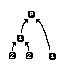
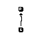
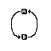
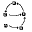
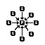
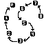

Normally, you want all parent related posts to be the children of a single post. But sometimes, you can have parent-trees, and in worse cases, cyclic parent-graphs.

---

If you are not familiar with graphs, here are a few that apply to e621.

These are both trees. The only requirement for a graph to be a tree is if there are N nodes, there are N-1 edges.




This means if there are N nodes and N or more edges, there must be a cycle in the graph.




In general, parent relations on e621 should only be on a single level; which means from the parent, you can get to all the children.



If you ever see something that looks like a long chain, it is a tree, but it should probably be a pool instead



A simple search to find posts that are not in the optimal tree setup is
<a href="https://e621.net/post?tags=isparent%3Atrue+ischild%3Atrue">\{\{isparent:true ischild:true\}\}</a>

---

Here is a query to make all parent-trees
```sql
with recursive post_parent_tree(tree_id, post_id, child_id) as (
    -- all root nodes
    select p.post_id as tree_id, p.post_id, c.post_id as child_id
    from posts p inner join posts c on(p.post_id = c.parent_id)
    where p.parent_id is null
    union all
    -- the children of the root nodes
    -- last = curr.post_id, this = joiner, next = deeper.post_id
    select tree_id, curr.child_id, deeper.post_id
    from post_parent_tree as curr
    inner join posts as deeper on(curr.child_id = deeper.parent_id)
)
select * from post_parent_tree
```

It is then trivial to find posts that have a parent, and are not in a tree. This implies they are in a cyclic graph.

```sql
select post_id from posts
where posts.parent_id is not null
except (
    select parent_id as p from post_parent_tree
union
    select child_id as p from post_parent_tree
)
```