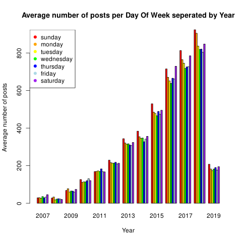

Which day is the most popular to upload posts on? Has this changed over time?

```sql
select
	-- divide by 52 to turn from total to average
	count(*)::float / 52 as daily_average,
	date_part('year', created_at)::int as upload_year,
	date_part('dow', created_at)::int as day_of_week
	-- dow starts at 0 = sunday
from posts
group by upload_year, day_of_week
order by upload_year asc
```

```r
data <- read.csv("data.csv")
png(filename = "avg_posts_per_day.png")

matrix <- do.call(rbind, data.frame(
	subset(data, day_of_week==0)$daily_average, # sunday
	subset(data, day_of_week==1)$daily_average, # monday
	subset(data, day_of_week==2)$daily_average, # tuesday
	subset(data, day_of_week==3)$daily_average, # wednesday
	subset(data, day_of_week==4)$daily_average, # thursday
	subset(data, day_of_week==5)$daily_average, # friday
	subset(data, day_of_week==6)$daily_average  # saturday
))

colors <- c("red","orange", "yellow", "green", "blue", "lightblue", "purple")

barplot(
	matrix,
	main = "Average number of posts per Day Of Week seperated by Year",
	xlab = "Year",
	ylab = "Average number of posts",
	names.arg = seq(from = min(data$upload_year), to = max(data$upload_year)),
	col = colors,
	space = c(0, 2),
	beside = TRUE
)

legend(
	"topleft",
	pch = rep(19, each = 7),
	col = colors,
	legend = c("sunday", "monday", "tuesday", "wednesday", "thursday", "friday", "saturday")
)
```

It's important to know that these times are based off the server time for e621, not local time.

