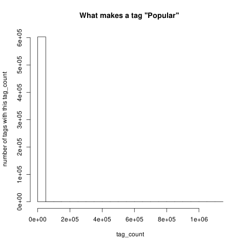
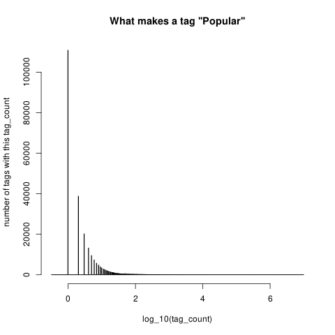
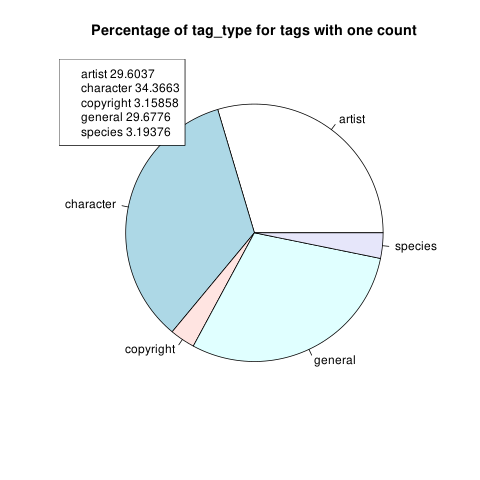

Spelling mistakes happen to everyone. But there isn't much that can be done to prevent them on e621. Many artists *have* names that are misspellings and just blindly replacing their name with the correct spelling would be wrong.

This means that if fixing spelling mistakes were to be done, it would have to be manual tag editing. The first step to fixing many of these tags is finding out what is spelt wrong.

---

The first thing that is needed is a way to find the similarity between strings in postgres. This isn't something that is shipped by default, so you will want to install `postgresql-contrib` (on ubuntu the command is just `sudo apt-get install postgresql-contrib`)

After that we want to enable it in postgres by executing `create extension pg_trgm;`

Now for efficiency let's create a materialized view of tag counts

```sql
create materialized view tag_name_count as (
	select tag_id, tag_name, tag_type, coalesce(tag_count, 0) as tag_count
	from tags full join (
		select tag_name, count(*) as tag_count from (
			select unnest(tags) as tag_name from posts
		) as a
		group by tag_name
	) as raw_tag_count
	using(tag_name)
)
```

---

After this it's pretty simple to make a query to find similar tags

```
sql
select *, similarity(t1.tag_name, t2.tag_name)
from tag_name_count as t1
join tag_name_count as t2 on(t1.tag_name != t2.tag_name)
order by similarity(t1.tag_name, t2.tag_name) desc
```

---

After some time you will notice this query is still running, and I'll give you a hint. It probably wont complete. Why? Because there are an enormous amount of rows it has to parse!

With a simple `select count(*) from tags` we can see there are just over 600,000 tags. The database would then have to calculate 600,000<sup>2</sup> rows. Thats 360,000,000,000 or 360 billion rows.

The problem isn't sorting that many rows, its just about processing that many rows. We should just start with reducing that number.

---

One assumption we can make is that we do not care about spelling errors in low frequency tags. Let's say someone tagged something with `foo` and another user made a mistake and tagged another post with `boo` instead. We would only care if one of these was a popular tag.

But what makes a tag "popular" ?

```sql
select tag_count from tag_name_count
```

```R
data <- read.csv("data.csv")
png("popular_tags_1.png")
hist(
	data$tag_count,
	xlab = "tag_count",
	ylab = "number of tags with this tag_count",
	main = "What makes a tag ''Popular''"
)
```



---

Well thats not very helpful. Let's make this a log graph to see if we can understand the data any better.

```r
options(scipen = 5)
data <- read.csv("data.csv")
png("popular_tags_2.png")
hist(
	log10(data$tag_count),
	xlab = "log_10(tag_count)",
	ylab = "number of tags with this tag_count",
	main = "What makes a tag ''Popular''",
	breaks = seq(-0.5, 7, by = 0.01),
	col = "black"
)
```



This graph may seem a bit backwards. Tags to the right are more popular, and it also means an overwhelming majority of tags have less than 10 posts. Could this mean that the vast majority of tags are spelling mistakes?

---

I have a hunch that all these tags are either artist, character, or copyright tags, but how correct am I?

```sql
select tag_type from tag_name_count where tag_count = 1
```

```R
data <- read.csv("data.csv")
png("tag_distribution.png")
freq_table = table(data$tag_type)
pie(
	freq_table,
	main = "Percentage of tag_type for tags with one count"
)
total = sum(freq_table)
freq_table <- signif(100 * freq_table / total, 6)
legend(
	"topleft",
	legend = paste(names(freq_table), freq_table)
)
```



---

As a quick aside, what if we want to look at all these tags?. Lets make a quick query to see them all.

```sql
select tag_id, tag_name, tag_type
from tag_name_count
where tag_count = 1
order by tag_type, tag_id
```

My exploration of the topic stops here, so here is [a link](tag_count_1_list.html) to view all the tags with count = 1. This file doesn't have any links because it makes the page almost 10MiB. I could add some javascript and make the page more lightweight while allowing links, but I do not want to add javascript to this.

---

Continuing with the idea of splitting the tags into popular and not popular. It seems that there are almost no tags with a tag_count of 10<sup>2</sup>. In fact, there's only around 14,000. That means that there are 300,000 below 100. That means we have 4,200,000,000 rows. Thats still more than we want to deal with.

Well lets write the query for what we are going to do.

```sql
select *, similarity(t1.tag_name, t2.tag_name) from
tag_name_count as t1 full join tag_name_count as t2 on(
	similarity(t1.tag_name, t2.tag_name) > 0.5	
and t1.tag_id != t2.tag_id
)
where t1.tag_count > 100
and   t2.tag_count <= 100
and   t2.tag_count > 0
order by t1.tag_name
```

I left this running on my machine for one hour and twenty minutes, and it still didn't complete. Lets move the split number to 1,000 instead.

Running this at a the 1,000 tag split it only took an hour. The output was 2.4MiB and because of that, [here is a link](similar_tags.html) to an interactive website to interact with.